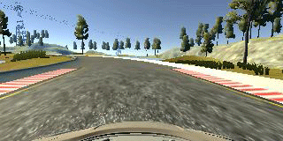
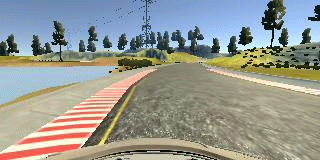

# 
# Behavioral Cloning Project for Udacity Self-Driving Car Nanodegree


## Overview

This project trains a vehicle to drive autonomously in a simulator using deep learning. The deep neural network takes camera images as inputs and give real-time predictions of steering angle. It generally follows these steps: 

* Data collection
* Image preprocessing
* Build and train a deep neural network
* Test model in a simulator

You can check up the video of the actual driving: https://drive.google.com/open?id=0B8g4mCBBmkoaYWZIZFpLampCc00


## Codes

* model.py
This script imports the image data and trains the model to predict a steering angle. The model and weights are saved as **model.json** and **model.h5**.

* drive.py
This is the python script that receives the data, predicts the steering angle using the deep learning model, and sends the throttle and the predicted angles to the simulator. 

* model.json: saved model

* model.h5: saved weights


## Data

There are totally 28273 images collected, 3142 for testing, 23895 for training, and 4217 for validation. Only images from center camera are used. The data I collected basically consists: 
* forward normal driving:    2 laps
* reverse normal driving:    1 lap
* forward recovery:          3 laps
* reverse recovery:          2 laps
* drive each turn for 2 times & 2 recovery from near the left lane line & 2 recovery from near right lane line
* drive sharp turns for 2 more time & 2 recovery from near the left lane line & 2 recovery from near right lane line

Through the steps above, I found that it is enough for the model to learn a relatively smooth driving behvior. 

For example, here is a normal driving:



And this is a recovery: 



## Preprocessing

There are three main steps to preprocess the data:
* Resizing - cropping the top and bottom part to exclude the impact of other objects such as trees, engine hood and so on. Then reducing the size by 25% to (80, 18).
* Color channel - using just one channel is more efficient in terms of time and space.
* Normalization - scaling the data to the range of -0.5 to 0.5


## Network Architecture

The actual deep neural network consists of 1 normalization layer, 4 convolution layers with ReLU activations, 1 MaxPooling layer then 1 dropout of 0.25, then 1 flattern layer and 4 fully connected layers, 1 dropout layer of 0.5 before the last layer. More details of the parameters of each layer can be found below:

```python
model = Sequential()
model.add(Lambda(lambda x: x/255 - 0.5, input_shape=(row, col, ch)))
model.add(Convolution2D(16, 3, 3, border_mode='valid'))
model.add(Activation('relu'))
model.add(Convolution2D(8, 3, 3))
model.add(Activation('relu'))
model.add(Convolution2D(4, 3, 3))
model.add(Activation('relu'))
model.add(Convolution2D(2, 3, 3))
model.add(Activation('relu'))
model.add(MaxPooling2D(pool_size=(2,2)))
model.add(Dropout(0.25))
model.add(Flatten())
model.add(Dense(16))
model.add(Activation('relu'))
model.add(Dense(16))
model.add(Activation('relu'))
model.add(Dense(16))
model.add(Activation('relu'))
model.add(Dropout(0.5))
model.add(Dense(1))
```
    ____________________________________________________________________________________________________
    Layer (type)                     Output Shape          Param #     Connected to
    ====================================================================================================
    lambda_1 (Lambda)                (None, 18, 80, 1)     0           lambda_input_1[0][0]
    ____________________________________________________________________________________________________
    convolution2d_1 (Convolution2D)  (None, 16, 78, 16)    160         lambda_1[0][0]
    ____________________________________________________________________________________________________
    activation_1 (Activation)        (None, 16, 78, 16)    0           convolution2d_1[0][0]
    ____________________________________________________________________________________________________
    convolution2d_2 (Convolution2D)  (None, 14, 76, 8)     1160        activation_1[0][0]
    ____________________________________________________________________________________________________
    activation_2 (Activation)        (None, 14, 76, 8)     0           convolution2d_2[0][0]
    ____________________________________________________________________________________________________
    convolution2d_3 (Convolution2D)  (None, 12, 74, 4)     292         activation_2[0][0]
    ____________________________________________________________________________________________________
    activation_3 (Activation)        (None, 12, 74, 4)     0           convolution2d_3[0][0]
    ____________________________________________________________________________________________________
    convolution2d_4 (Convolution2D)  (None, 10, 72, 2)     74          activation_3[0][0]
    ____________________________________________________________________________________________________
    activation_4 (Activation)        (None, 10, 72, 2)     0           convolution2d_4[0][0]
    ____________________________________________________________________________________________________
    maxpooling2d_1 (MaxPooling2D)    (None, 5, 36, 2)      0           activation_4[0][0]
    ____________________________________________________________________________________________________
    dropout_1 (Dropout)              (None, 5, 36, 2)      0           maxpooling2d_1[0][0]
    ____________________________________________________________________________________________________
    flatten_1 (Flatten)              (None, 360)           0           dropout_1[0][0]
    ____________________________________________________________________________________________________
    dense_1 (Dense)                  (None, 16)            5776        flatten_1[0][0]
    ____________________________________________________________________________________________________
    activation_5 (Activation)        (None, 16)            0           dense_1[0][0]
    ____________________________________________________________________________________________________
    dense_2 (Dense)                  (None, 16)            272         activation_5[0][0]
    ____________________________________________________________________________________________________
    activation_6 (Activation)        (None, 16)            0           dense_2[0][0]
    ____________________________________________________________________________________________________
    dense_3 (Dense)                  (None, 16)            272         activation_6[0][0]
    ____________________________________________________________________________________________________
    activation_7 (Activation)        (None, 16)            0           dense_3[0][0]
    ____________________________________________________________________________________________________
    dropout_2 (Dropout)              (None, 16)            0           activation_7[0][0]
    ____________________________________________________________________________________________________
    dense_4 (Dense)                  (None, 1)             17          dropout_2[0][0]
    ====================================================================================================

Total params number is 8,023, which is relatively small, the aim of designing in such a way that makes a complicated structre with small amount of parameters is to make the model complex enough to learn the driving skill without overfit, and meanwhile maintain a quick response to newly added data for some specific sharp corners. 


# Training

The training was done a moderate Windows 10 laptop with Core i5-6200U, 8GB of RAM. Since the image size is reduced to 80x18, the actual memory consuming is low and the trainning is done in roughly 6 minutes for 4 epochs. This allows multiple runs in a short time for adjusting some parameters of the neural network.

```
Epoch 1/4
23895/23895 [==============================] - 100s - loss: 0.0340 - acc: 0.2342 - val_loss: 0.0244 - val_acc: 0.2286
Epoch 2/4
23895/23895 [==============================] - 90s - loss: 0.0285 - acc: 0.2344 - val_loss: 0.0232 - val_acc: 0.2288
Epoch 3/4
23895/23895 [==============================] - 91s - loss: 0.0274 - acc: 0.2343 - val_loss: 0.0226 - val_acc: 0.2284
Epoch 4/4
23895/23895 [==============================] - 87s - loss: 0.0262 - acc: 0.2342 - val_loss: 0.0216 - val_acc: 0.2284
```

# Testing

The test score and accuracy on the testing data are as follows:

Test score|Test accuracy
:----|:-----:
0.021|0.226

And the model is tested on the simulator in automonous driving mode for 5 laps without touching any lane lines or edges, the car drives in a relatively smooth manner. And the actual driving behivor is roughly shown in a gif image: 


# Reflections

* Whole image confuses the model as there are other objects such as trees, engine hood, etc, therefore cropping the image might be a good idea to let the model focus on predicting base on lane lines.

* Self-collected data seems to perform better than those provided by Udacity in terms of training efficiency.

* The loss and accuray for this problem is not a very good measure of smooth driving, the simulator is the real test. 

* Longer training epochs do not yield better driving for this specific problem. After many runs, practice tells that 3-6 might be a good choice, and it saves time. 

